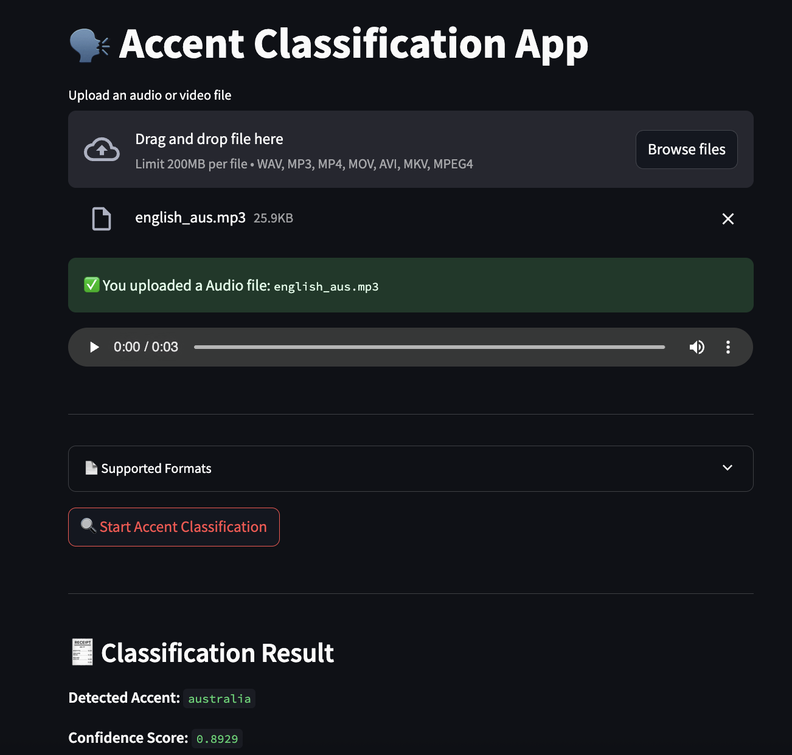

# 🗣️ Accent Classification App

This is a Streamlit-based application that classifies the accent in an audio or video file using the [SpeechBrain](https://speechbrain.readthedocs.io/en/latest/index.html) pretrained model for English accents.



## 🔍 Features

- Upload **audio** (`.wav`, `.mp3`, `.m4a`) or **video** (`.mp4`, `.mov`, `.avi`, `.mkv`)
- Automatic file-type detection and preview
- Converts video/audio to mono 16kHz `.wav` format for processing
- Accent prediction using a SpeechBrain Wav2Vec2 model
- Confidence score and raw model score display
- Simple, interactive Streamlit UI

---

## ⚙️ Requirements

- Python **3.10**
- FFmpeg installed (`brew install ffmpeg` on macOS)

---

## 📦 Installation

Install the dependencies (from a clean Python 3.10 environment):

```bash
pip install streamlit
pip install speechbrain
pip install -U torch torchaudio --no-cache-dir
```

---

## 🚀 Run the App

```bash
python -m streamlit run accent_classification_ui/streamlit_ui.py
```

---

## 📁 Project Structure

```
accent_classification/
├── accent_classification_engine/       # Core logic (conversion, classification)
├── accent_classification_ui/           # Streamlit UI
├── tests/                              # Unit & integration tests
├── requirements.txt
├── pyproject.toml
├── Makefile
└── README.md
```

---

## 🧪 Run Tests

```bash
make test
```